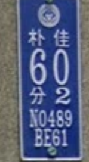
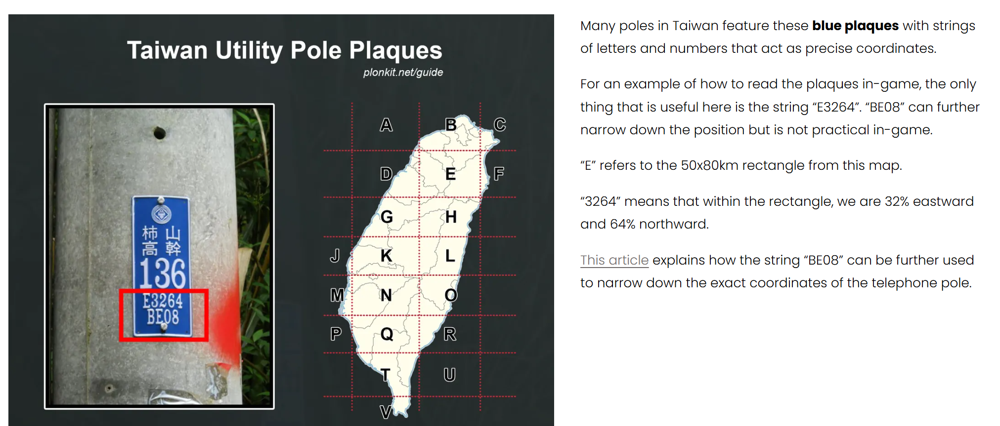
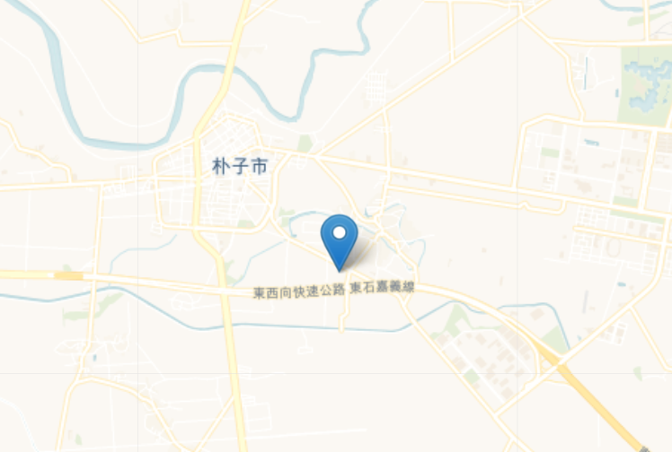
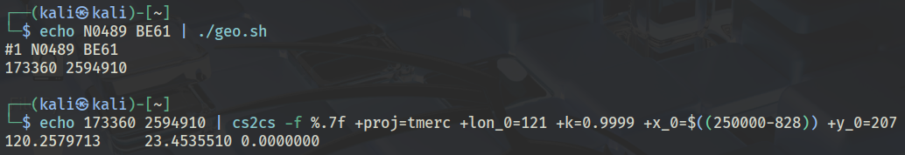
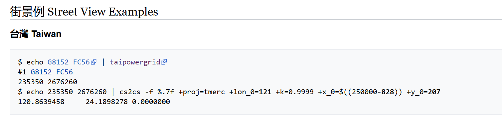

Looking around, I spotted a power pole with a label:

A simple google image search tells you that these are common utility poles in Taiwan.

Then, I found this reddit post,  ["A map I made to help with Taiwan power pole codes."](https://www.reddit.com/r/geoguessr/comments/1k4dsax/a_map_i_made_to_help_with_taiwan_power_pole_codes/), mentioning an even more detailed post on [Taiwan](https://www.plonkit.net/taiwan)

Using this, the label I found must be in the N section, **4% eastward and 89% northward**.
However,  since the CTF requires the location to be within 250m of the actual place, I needed to be more precise. The above article had a link to another [website](https://wiki.osgeo.org/wiki/Taiwan_Power_Company_grid#.E8.A1.97.E6.99.AF.E4.BE.8B_Street_View_Examples) with a script to convert Taiwan power pole labels to the exact (almost) coordinates. 

Being the script kiddie I am, I downloaded the file and ran the script on the target label, getting the coordinates of **23.4535, 120.2579**

Flag: `nite{1'v3_b33n_w41t1ng_f0r_y0u_4t_cape_no._7}`

