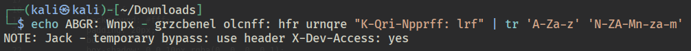
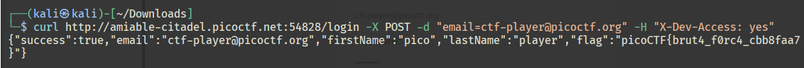

# Challenge Description

We’re in the middle of an investigation. One of our persons of interest, ctf player, is believed to be hiding sensitive data inside a restricted web portal. We’ve uncovered the email address he uses to log in: `ctf-player@picoctf.org`. Unfortunately, we don’t know the password, and the usual guessing techniques haven’t worked. But something feels off... it’s almost like the developer left a secret way in. Can you figure it out? The website is running here. Can you try to log in?

# Hint(s)
1. Developers sometimes leave notes in the code; but not always in plain text.
2. A common trick is to rotate each letter by 13 positions in the alphabet.

# Solution
- checking the page source, there is a comment.
- by hint 2, reverse the rot13 encryption



- we know that sending a http request with header `X-Dev-Access` allows us to bypass the login
- i like working with cURL, so let's go ahead and send a post request with the email and the additional header



Flag: ```picoCTF{brut4_f0rc4_cbb8faa7}```