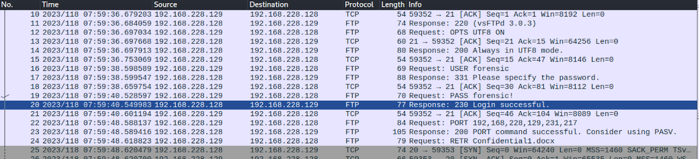
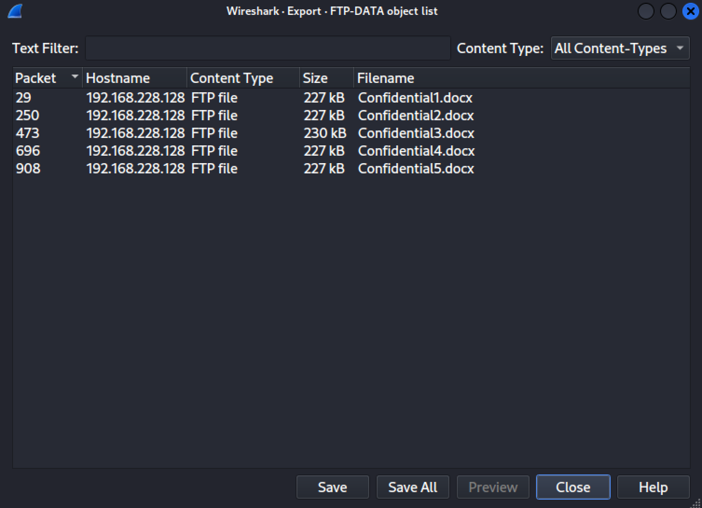

Flag format: CDDC2023{md5(Time of successful login to FTP_found character string)}

## Solution

- No. 20 shows login successful, if your time display settings isn’t already converted to UTC, go to: View > Time Display Format > UTC Date and Time of Day

UTC Time of login: 230428-07:59:40

- Further analysis of the packets shows that the user uploaded a few files to the server under the **FTP-DATA protocol** which include Confidential1.docx, Confidential2.docx, Confidential3.docx, Confidential4.docx, Confidential5.docx. There is good reason to believe that the flag is in one of these documents.

- To extract the files from the packets, simply do the following:
`File > Export Objects > FTP-DATA > Save All [files to any preferred directory]`

- Opening Confidential3.docx will give you the second half of the flag: PcApng_@N@ly5i5_15_3@zzzZZzzzy~!

Run **230428-07:59:40_PcApng_@N@ly5i5_15_3@zzzZZzzzy~!** through an MD5 hash generator.

Flag: `CDDC2023{1b8ab1433f7dbdd467193e3858b81206}`

## Tools Used

- Wireshark for network analysis