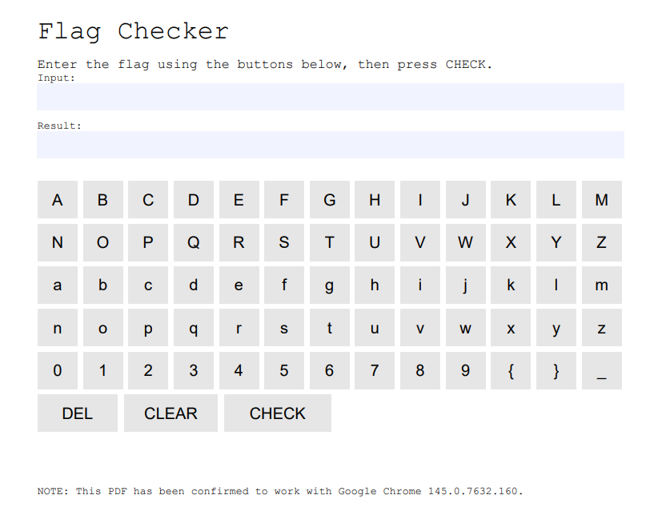

## Problem
``Please read this first.`` with an attached pdf.



## Solution
Running `strings readme.pdf`, the very top of the output shows a snippet of the flag checker written in JavaScript:

```javascript
var expected = [46,49,56,57,46,60,33,16,110,44,110,9,57,40,107,42,46,5,107,52,5,10,30,28,39];
var k = 90;
function get_input\(\) {
    return globalThis.getField\("input_display"\).value;
function set_input\(v\) {
    globalThis.getField\("input_display"\).value = v;
function append_char\(c\) {
    set_input\(get_input\(\) + c\);
function delete_char\(\) {
    var v = get_input\(\);
    set_input\(v.slice\(0, -1\)\);
function clear_input\(\) {
    set_input\(""\);
function check_flag\(\) {
    var input_buf = get_input\(\);
    var result_field = globalThis.getField\("result_display"\);
    if \(input_buf.length !== expected.length\) {
        result_field.value = "Wrong";
        return;
    }
    for \(var i = 0; i < expected.length; i++\) {
        if \(\(input_buf.charCodeAt\(i\) ^ k\) !== expected[i]\) {
            result_field.value = "Wrong";
            return;
        }
    }
    result_field.value = "Correct";
```

Every character is **XOR**-ed with k which was defined to be 90.
```javascript
(input_buf.charCodeAt\(i\) ^ k\) !== expected[i]\)
```

>[!tip]- XOR Properties
>If: Plain ⊕ Key = Cipher
>
>Then: Plain ⊕ Key ⊕ Key = Cipher ⊕ Key
>
>Therefore: Plain = Cipher ⊕ Key


They were nice enough to give the expected values, use the concept above to write a simple Python script and decode the flag.

```python
expected = [46, 49, 56, 57, 46, 60, 33, 16, 110, 44, 110, 9, 57, 40, 107, 42, 46, 5, 107, 52, 5, 10, 30, 28, 39]
k = 90

flag = "".join([chr(x ^ k) for x in expected])
print(flag)
```

Flag: ```tkbctf{J4v4Scr1pt_1n_PDF}```

## References

- [XOR](https://en.wikipedia.org/wiki/Exclusive_or)