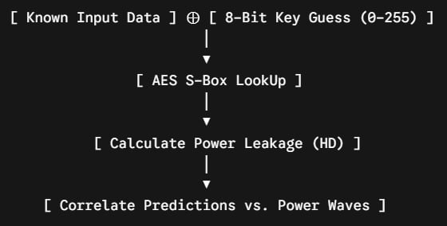

# Problem
>[!caution] Description
>'Kzzzt... Headquarters, please respond!
The perimeter in the depths of the Rift has collapsed!
A colossal beast that unleashes electrical tidal waves-'Kraken **AES**'-has appeared!' 
'The electrical tidal waves it generates are throwing the expedition into chaos.
>- But do not panic. **The first beacon is still secure**.
>- We need to analyse the electrical surge from the first beacon.'
>  
>*[The Kraken conceals its power, but in the instant it shifts its state, it releases energy.]*
>If you, Defender, analyse the surging waves, the key needed to seal the Kraken may be uncovered.
>Received from Hea___arters]
>Flag format : `CDDC2026{0x0123456789ABCDEF}`

# The Theory
Computer chips are made of millions of tiny electronic switches called CMOS transistors.

- stable binary, 0 or 1 = almost no current flows
- state switches, 0 to 1 or 1 to 0 = capacitors charge/discharge --> brief burst of electrical current rushes from the power supply

> [!hint]+ Core principle
> The amount of electrical power a chip consumes at any given microsecond is **directly proportional** to the number of bits flipping inside its hardware registers. 

(`traces.npy`) Power traces are recordings of tiny voltage fluctuations. 
## Timing Jitter
The lore tells us that the "first beacon is still secure". This means that trace 0 is the only pristine trace. **Use it to synchronise timing.**

Real-world chips intentionally inject random delays before starting the encryption. This is to safeguard the encryption process. The correct key cannot create a spike because its signal is smeared out across different time blocks.

## Leakage model
To turn raw power waves into a cryptographic key, we need a mathematical model that predicts how much power the chip should be using based on the data it is processing. The hamming weight model is primarily used in the industry.

>[!info] The hamming weight (HW) of a binary number is the count of the number of 1 bits in that number.
>The model assumes that the register clears to 0 before loading new data, meaning the power depends entirely on how many 1s are being loaded.

>[!info] The hamming distance measures how many bits physically change when a register transitions from an old state (A) to a new state (B).
> $HD(A,B)=HW(A \oplus B)$

**"In the instant it shifts its state, it releases energy"** = lore points directly to this model.
- power leakage based on the transition from the raw input block to the encrypted S-Box block
# Solution
## Correlation Power Analysis (CPA)
A standard AES-128 key is 16 bytes long. Trying to guess the entire key at once means testing $2^{128}$, which is impossible.

We use CPA to attack the key one byte at a time.
For a single byte, there are only 256 possible values.

> [!danger]- Attack Pipeline
> 

For every single encryption trace, we calculate what the internal state of the chip would look like for all 256 key guesses.

Then use the Pearson Correlation Coefficient to compare our predictions against the actual power traces across every single time sample.

## Detecting the leakage window for Trace 0

```python
import numpy as np
import matplotlib.pyplot as plt

traces = np.load('traces.npy')
# Calculate the variance across all 7500 traces for every single time sample
trace_variance = np.var(traces, axis=0)
plt.plot(trace_variance)
plt.title("Trace Variance (Leakage Detection)")
plt.show()
```

Running this shows a flat line that stays at near-0 and rockets straight up at exactly time sample 30 and drops back down at time sample 80.

Samples 30 to 80 contain the chip's initialization sequence (the "Beacon"). The chip runs this sequence _before_ it even looks at your plaintext data.

Because this sequence has nothing to do with the changing data, **its physical power wave looks perfectly identical in all 7,500 traces.** It is a massive, highly distinct, unchanging electrical signature.
## Defeating the timing jitter

We take the high-energy wave signature from Trace 0 and **use a sliding mathematical window** (cross-correlation) to find where that identical wave signature appears in the other 7,499 traces.

When the offset is calculated, we slide the messy traces back into place.

### Cross-correlation
At every single step, calculate a "Similarity Score"
- usually by multiplying the overlapping data points together and summing them up
	- if the waves are unaligned, the peaks multiply against valleys, canceling each other out
	- if the waves perfectly overlap, peak multiples by peak, and valley multiplies by valley, creating a massive compounding number

> [!success] Rolling traces
> Once Cross-correlation tells us that Trace X is shifted to the right by 45 samples, apply  `np.roll(X, -45)` to shift the electrical wave 45 samples to the left.
> 1. Calculate unique offset for all 7,499 traces
> 2. Roll them into perfect alignment with Trace 0
## Putting it all together: The Code
See the attached `.ipynb` for the full solution.
### Piece 1: The Raw Materials (The Blind Setup)

You start the attack with two files loaded into your script's memory:

* `plaintexts.npy` (`file_a`): A matrix of 7,500 rows and 4 columns. Each row contains the 4 bytes of data sent into the chip. This is your known control variable.
* `traces.npy` (`file_b`): A matrix of 7,500 rows and 1,000 columns. Each row is a physical recording of the chip's power consumption over 1,000 distinct moments in time.

The secret key is hardcoded inside the chip's silicon. It never changes. Your goal is to use the known data inputs to decode the physical power traces and expose that key.
### Piece 2: Defeating the Chaos (The Alignment Step)

Before you can run any cryptographic attacks, you have to deal with the Timing Jitter injected by the challenge author. The chip randomly delays the start of its operations for every execution.

If you try to run your correlation math right now, it will fail because the encryption step is sliding left and right randomly across the timeline from trace to trace.

#### **Step A: Finding the Anchor (The Beacon)**

The lore stated: *"The first beacon is still secure."* By looking at Trace 0, we observe a distinct, identical electrical wave pattern sitting between Time Samples 30 and 80. This isn't the encryption itself; it is the chip's predictable initialization sequence.

We slice out samples 30 to 80 from Trace 0 and save it as our master stencil (ref_window).

#### **Step B: The Cross-Correlation Scan**

We take our 50-sample stencil and mathematically slide it across all the other 7,499 messy traces, one sample position at a time. At each step, we multiply the overlapping numbers together to get a similarity score.

* If a trace was delayed by 15 cycles, its beacon pattern will now sit at sample 45.
* When our sliding stencil hits sample 45, the similarity score hits a massive peak. The script marks this index as best_start = 45.

#### **Step C: Shifting the Timeline**

We calculate the drift: shift = 45 - 30 = +15. This means this specific trace is running 15 cycles late.

To fix it, we use np.roll(trace, -15). This doesn't just move the beacon—**it shifts the entire 1,000-sample trace 15 steps to the left.

> 🚗 **The Bumper Analogy: Think of the beacon as the front bumper of a car and the encryption as the rear trunk. By using cross-correlation to line up all 7,500 front bumpers to the exact same starting line, you automatically force all 7,500 rear trunks to line up perfectly further down the road.

### Piece 3: The Physical Leakage Model (The Hardware Physics)

Now that all 7,500 traces are perfectly synchronized in time, the cryptographic signal is completely exposed. We invoke the lore's next clue: *"in the instant it shifts its state, it releases energy."*

This tells us the chip leaks power according to the Hamming Distance (HD) model. When the chip transitions a hardware register from an old value (the raw Plaintext input) to a new value (the S-Box encrypted output), the physical power consumed is directly proportional to how many bits had to flip from 0 to 1 or 1 to 0.

To simulate this physical process in Python, our leakage model formula must compute:

$$\text{Predicted Power} = \text{HammingWeight}(\text{Plaintext Byte} \oplus \text{SBox}[\text{Plaintext Byte} \oplus \text{Key Guess}])$$

### Piece 4: The 2D Guessing Engine (CPA Matrix)

With our physical model ready, we target Key Byte 0 and initiate a massive, brute-force statistical matrix.

1. The Guess Loop: We loop through all 256 possible byte values (0x00 to 0xFF) for our key guess.
2. The Prediction Generation: For a single guess (e.g., 0x9A), we take Column 0 of our plaintext file and calculate the predicted bit-flips across all 7,500 executions. This gives us a single vector of 7,500 predicted power values.
3. The Vertical Correlation Scan: We take those 7,500 predictions and run a Pearson Correlation calculation against our aligned traces column-by-column:
* Correlate against Sample Column 0 $\to$ Score is 0.01 (No match)
* Correlate against Sample Column 1 $\to$ Score is -0.02 (No match)
* ...
* Correlate against Sample Column 127 $\to$ Score explodes to 0.3046!
### Why does it explode?

Because 0x9A is the true key, your Python script and the physical silicon transistors are running the exact same mathematical operations. The power changes predicted by your script perfectly match the actual power draws recorded by the oscilloscope.

For all the other 255 wrong key guesses, the S-Box's chaotic nature turns the predictions into random garbage data. They result in flat, near-zero correlation scores ($0.01$ to $0.05$) across all 1,000 time samples.
## The Climax: Reconstructing the Blueprint

The script finds the maximum peak in our massive grid of correlation scores. It extracts the winning key byte value (the row) and the exact execution time sample (the column).

When the script finishes running for all 4 bytes, it prints the final structural blueprint:

* Byte 0: Winner 0x9A at Sample 127
* Byte 1: Winner 0xD0 at Sample 177 (Exactly 50 clock cycles later)
* Byte 2: Winner 0xBE at Sample 227 (Exactly 50 clock cycles later)
* Byte 3: Winner 0x39 at Sample 277 (Exactly 50 clock cycles later)

# References
- [Side-Channel Attack](https://en.wikipedia.org/wiki/Side-channel_attack)
- [AES](https://en.wikipedia.org/wiki/Advanced_Encryption_Standard)
- Google Gemini

Flag: ```CDDC2026{0x9AD0BE39}```
